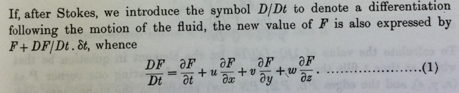
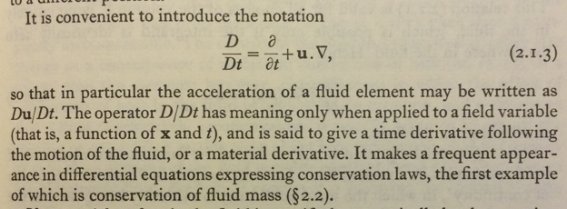
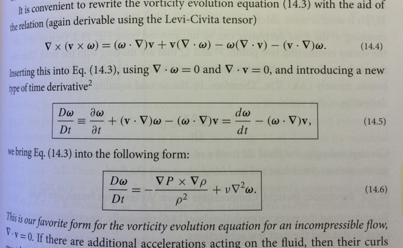

## An Encomium for *D/Dt* Notation

In this panegyric, I discuss Sir George Gabriel Stokes' *D/Dt* notation for the material derivative, and defend it against Nobel-Prize wielding arrivistes.  Of course, disagreements about notation are among the most pointless in science, so please regard this essay for its entertainment value only.  😁  Shameless appeals to authority, as exercised below, have no place in actual scientific disagreements, but remain in fashion for mock disputes.  🤣  I have included excerpts from several key texts, and I apologize for the distortion in the images.

&emsp; -- Christopher Tong, Ph.D. (physics).

### The Material Derivative

One of a student's first lessons in fluid dynamics is the use, in the standard local field theory of D'Alembert and Euler, of a total derivative known as the *material derivative*,
*convective derivative*, *substantive derivative*, or *barycentric derivative*.  For instance, the classic monograph by Sir Horace Lamb (1932, sec. 5) includes the following passage, using Cartesian coordinates.

Lamb used the *D/Dt* notation introduced by Stokes himself, in the paper where he gives the essentially modern continuum derivation of the Navier-Stokes equations (Stokes, 1849, Sec. 5; see my *Appendix* below).  Other authors use either *d/dt* or *D/Dt* for this concept.  Batchelor (1967, sec. 2.1), for instance, has this passage.

The *Feynman Lectures* have a nice derivation of this expression in [Chapter 40](https://www.feynmanlectures.caltech.edu/II_40.html) (Sec. 2), which you can read for free.  However, Feynman did not use any special notation for the material derivative, nor did Subramanyan Chandrasekhar (1961) and Steven Weinberg (2021, sec. 2.5).  Speaking of Nobel laureate physicists, Lord Rayleigh (1894, 1916) did use the *D/Dt* notation.  Several hydrodynamics books written by physicists, such as Tritton (1988, Sec. 5.5), Faber (1995, Sec. 2.4), and Rieutord (2015, sec. 1.3.4), have entire sections dedicated to the material derivative; the three cited authors all use the *D/Dt* notation for it.  

On the other hand, Jeffries & Jeffries (1956, Sec. 3.1063) write that "there seems to be no adequate reason against regarding the operator as an ordinary total time derivative and denoting it by *d/dt*.  The notation *D/Dt* is really a survival from the time when *d/dt* was used to denote partial differentiation."  A look at Stokes' original 1849 paper (see *Appendix* below) seems to confirm that he used *d/dt* to indicate partial differentiation, so he would indeed have needed another symbol for a total derivative.  According to Jeff Miller at [MacTutor](https://mathshistory.st-andrews.ac.uk/Miller/mathsym/calculus/), the "curly d" notation for partial derivative, due to Condorcet (1773), and in its modern form to Legendre (1786), was reintroduced by Jacobi (1841). Perhaps Jacobi's usage had not diffused to Cambridge University by the time Stokes was writing about fluid mechanics.  If so, has the time come to decommission *D/Dt* as obsolete?  I think not!

A particularly insightful discussion on this notation is provided by Sir James Lighthill, who like Stokes, was a holder of Sir Issac Newton's Lucasian Chair of Mathematics at Cambridge University.  (Other holders of this chair include Charles Babbage, Paul Dirac, and Stephen Hawking!)  Lighthill (1986, Sec. 3.1) wrote:

Here Lighthill defends the use of *D/Dt* rather than *d/dt* for this use in fluid dynamics.  Perhaps not without reason then, many other mathematicians who write about hydrodynamics use *D/Dt* as well (e.g., Acheson, 1990; Birkhoff, 1960; Chorin and Marsden, 2000; and Lin and Segel, 1974).  However, many key writers in physics, including Planck (1932), Alfven (1942), and Landau & Lifshitz (1959), continued to use *d/dt* instead of *D/Dt*. 🙁 Paradoxically, though Prandtl (1952) used *d/dt*, Prandtl and Tietjens (1934, sec. 49) used the hybrid notation *D/dt*.  The latter convention is also adopted briefly by Rajeev (2018), though most of the time he just writes out the full expression in tensor notation.  

Surveying other hydrodynamics works by physicists (such as those listed [here](booksByPhysicists.md)) shows about an even split between the use of *d/dt* and *D/Dt* for the material derivative.  😒  The *D/Dt* notation is less common among statistical physicists, though I know of at least one text that uses it (Kreuzer, 1981), as well as one by a chemist that does (McQuarrie, 2000).  Among the atmospheric and oceanographic sciences, the *D/Dt* notation is not dominant, but it is used in some of the most prominent texts (e.g., Holton, 2004; Gill, 1982; and Salmon, 1998).  Similarly, many important texts in mechanical and aerospace engineering use *D/Dt* (e.g., Anderson, 2002; Panton, 2013; Smits, 1999; and White, 2005) as does the classic chemical engineering text by Bird, Stewart, and Lightfoot (2007).  (I plead guilty to cherry-picking these examples 😅.)  Alas, White (2005) is almost apologetic about using the *D/Dt* notation, which he says is "purely a mnemonic device, not intended to frighten readers."  😱

Liepmann and Roshko (1957) used *D/Dt* but curiously named it the *Eulerian derivative*.  It is indeed likely that Leonhard Euler was the first to write the fluid acceleration term, as we understand it, in its three-dimensional form, but in one dimension it was previously intuited by Daniel Bernoulli's father, Johann, and expressed in field theoretic form by Jean le Rond D'Alembert (Darrigol, 2005).  The *D/Dt* notation was not used by any of them; it is due to solely to G. G. Stokes (1849). Hence, some writers call it the *Stokes operator*.

A few physicists (Bruus, 2008; Hertel, 2012) use the simple notation $D_t$ for the material derivative.  Jose and Saletan (1998) compromise by using *both* the *D/Dt* and $D_t$ notations.  🤔

### The "Fluid Derivative"

Kip Thorne and Roger Blandford, in their *Modern Classical Physics* (2017), also use *d/dt* for the material derivative, but go one step further.  See this excerpt from Sec. 14.2.1:

Their footnote 2 indicates that "The combination of spatial derivatives appearing here is called the *Lie derivative*", and that it is the commutator of the velocity and vorticity vectors, an operator "often encountered in differential geometry."  They provide alternate notations for the Lie derivative, either $\cal{L}_v$ or by using commutator brackets.  They go on to use the term "fluid derivative" for their expression 14.5 when acting on a vector (and when acting on a scalar, they state is it just the convective derivative).  Finally they parenthetically (and dismissively) note that "The notation *D/Dt* is used in some older texts for the convective derivative *d/dt*."  Excuse me?  I have never seen any other text use *D/Dt* for expression 14.5.  Thorne and Blandford have appropriated Stokes' notation for an expression other than what Stokes (and generations of authors after him) intended.  As far as I can tell, this usage is unique to Thorne and Blandford.  😬

It is true that the "fluid derivative" bears a resemblence to the Poisson bracket formulation of Liouville's theorem, lending itself to a hydrodynamic analogy seen in upper level treatments of classical mechanics and the kinetic theory of gases.

I predict that Thorne and Blandford's revisionist notation will not catch on.  The *D/Dt* notation for the material derivative is too entrenched, and for good reason (as the Lighthill passage indicates).  Thorne and Blandford's "fluid derivative" could easily be denoted as the sum of *D/Dt* and the Lie derivative (or equivalently the commutator of the velocity and vorticity vectors).

Won't you join me in the Campaign to Save Stokes' version of *D/Dt*?  :wink:

### Appendix:  Stokes himself

This is an excerpt from Stokes (1949) where *D/Dt* first appears.

 

The use of a capital *D* as a differential operator in hydrodynamics is actually older than Stokes.  Joseph-Louis Lagrange introduces such an operator in volume 2, Section XI, subsection 1, of *Mecanique analytique, novelle edition* (1811), which covers the motion of incompressible fluids, but it appears to mean something different than Stokes' meaning.  He never used the notation *D/Dt*.

To add to the confusion, in general relativity, the *covariant derivative* is sometimes denoted using a capital *D* operator as well.

### References

D. J. Acheson, 1990:  *Elementary Fluid Dynamics*.  Oxford Applied Mathematics and Computing Science Series.  Oxford University Press.

H. Alfven, 1942:  Existence of electromagnetic-hydrodynamic waves.  *Nature*, 150:  405-406.

J. D. Anderson, 2002:  *Modern Compressible Flow: with Historical Perspective*, 3d edition. McGraw-Hill.

G. K. Batchelor, 1967:  *Introduction to Fluid Dynamics*.  Cambridge University Press.

R. B. Bird, W. E. Stewart, and E. N. Lightfoot, 2007: *Transport Phenomena*, revised 2d edition. Wiley.  (Original edition, 1960.)

G. Birkhoff, 1960:  *Hydrodynamics:  A Study in Logic, Fact and Similitude*, revised edition.  Princeton University Press.  Reprinted in the Princeton Legacy Library series.

H. Bruus, 2008:  *Theoretical Microfluidics*.  Oxford Master Series in Condensed Matter Physics.  Oxford University Press.

S. Chandrasekhar, 1961:  *Hydrodynamic and Hydromagnetic Stability*.  Inernational Series of Monographs on Physics.  Oxford University Press.  Reprinted by Dover, 1981.

A. J. Chorin and J. E. Marsden, 2000:  *A Mathematical Introduction to Fluid Mechanics*, 3d edition.  Texts in Applied Mathematics, vol. 4.  Springer.

O. Darrigol, 2005:  *Worlds of Flow:  A History of Hydrodynamics from the Bernoullis to Prandtl*.  Oxford University Press.

T. E. Faber, 1995:  *Fluid Dynamics for Physicists*.  Cambridge University Press.

A. Gill, 1982:  *Atmosphere-Ocean Dynamics*.  International Geophysics Series, vol. 30.  Academic Press.

P. Hertel, 2012:  *Continuum Physics*. Graduate Texts in Physics. Springer. 

J. R. Holton, 2004:  *An Introduction to Dynamic Meteorology*, 4th edition.  International Geophysics Series, vol. 88.  Elsevier.

H. Jeffries and B. S. Jeffries, 1956:  *Methods of Mathematical Physics*, 3d edition.  Cambridge University Press.  Reprinted 2001.  Original edition published in 1946.

J. V. Jose and E. J. Saletan, 1998: *Classical Dynamics: A Contemporary Approach*. Cambridge University Press.

H. J. Kreuzer, 1981:  *Nonequilibrium Thermodynamics and its Statistical Foundations*.  Monographs on the Physics and Chemistry of Materials.  Oxford University Press.

J.-L. Lagrange, 1997:  *Analytical Mechanics*, translated from the *Mecanique Analytique, novelle edition* of 1811.  Translated and edited by A. Boissonnade and V. N. Vagliente.  Boston Studies in the Philosophy of Science, vol. 191.  Kluwer.

H. Lamb, 1932:  *Hydrodynamics*, 6th edition.  Cambridge University Press.  Reprinted with a forward by R. A. Caflisch, 1997.

L. D. Landau and E. M. Lifshitz, 1959:  *Fluid Mechanics*.  Course of Theoretical Physics, vol. 6.  Pergamon Press.

H. W. Liepmann and A. Roshko, 1957:  *Elements of Gasdynamics*.  McGraw-Hill.  Reprinted with corrections and an appendix by Dover, 2001.

J. Lighthill, 1986:  *An Informal Introduction to Theoretical Fluid Mechanics*.  IMA Monograph Series, vol. 2.  Oxford University Press.

C. C. Lin and L. A. Segel, 1974:  *Mathematics Applied to Deterministic Problems in the Natural Sciences*.  Macmillan.  Reprinted with corrections by SIAM, 1988.

D. A. McQuarrie, 2000:   *Statistical Mechanics*.  University Science Books.

R. L. Panton, 2013: *Incompressible Flow*, 4th edition.  Wiley.

M. Planck, 1932:  *Mechanics of Deformable Bodies*.  Introduction to Theoretical Physics, vol. 2; translated from the third German edition by Henry L. Brose.  Macmillan.  (Original German edition, 1919.)

L. Prandtl, 1952:  *Essentials of Fluid Dynamics, With Applications to Hydraulics, Aeronautics, Meteorology and other Subjects*.  Hafner.

L. Prandtl and O. G. Tietjens, 1934:  *Fundamentals of Hydro- and Aeromechanics*.  Engineering Societies Monographs.  McGraw-Hill.  Reprinted by Dover, 1957.

S. Rajeev, 2018:  *Fluid Mechanics: A Geometrical Point of View*. Oxford University Press. 

Lord Rayleigh, 1894:  *Theory of Sound*, 2d edition, vol. 2.  Corrected reprint, 1929; Dover reprint, 1945.

Lord Rayleigh, 1916: On convection currents in a horizontal layer of fluid when the higher temperature is on the under side. *Philosophical Magazine*, series 6, 32: 529-546.

M. Rieutord, 2015:  *Fluid Dynamics:  An Introduction*.  Graduate Texts in Physics.  Springer.

R. Salmon, 1998:  *Lectures on Geophysical Fluid Dynamics*.  Oxford University Press.

A. J. Smits, 1999: *A Physical Introduction to Fluid Mechanics*. Wiley.

G. G. Stokes, 1849:  On the theories of the internal friction of fluids in motion, and of the equilibrium and motion of elastic solids.  *Transactions of the Cambridge Philosophical Society*, 8: 287-305.  (Presented in 1845.)

K. S. Thorne and R. D. Blandford, 2017:  *Modern Classical Physics:  Optics, Fluids, Plasmas, Elasticity, Relativity, and Statistical Physics*.  Princeton University Press.

D. J. Tritton, 1988:  *Physical Fluid Dynamics*, second edition.  Oxford University Press.

S. Weinberg, 2021:  *Foundations of Modern Physics*.  Cambridge University Press.

F. M. White, 2005:  *Viscous Fluid Flow*, 3d edition. McGraw-Hill.

[Return to main page](https://hydrodynamicstability.github.io/Invitation-to-Hydrodynamics/)

#### Disclaimers

The content on this site was developed solely on my personal time. The views expressed are solely my own, and do not necessarily represent the views, policies, or opinions of my employer or any organization with which I am affiliated.

(c) 2022 by Christopher Tong.  
