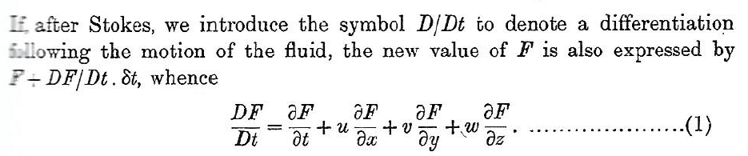
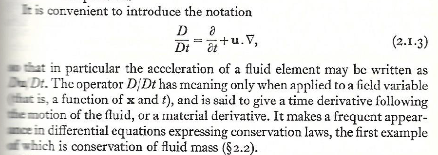
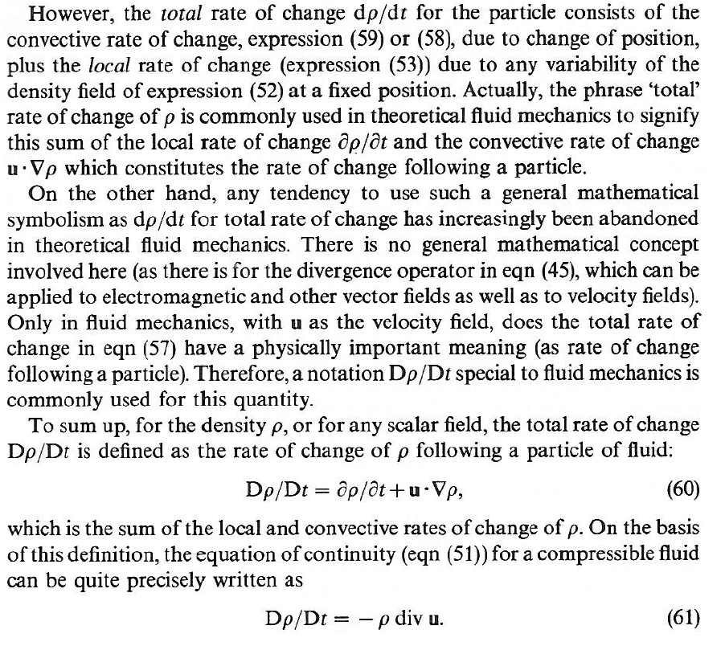
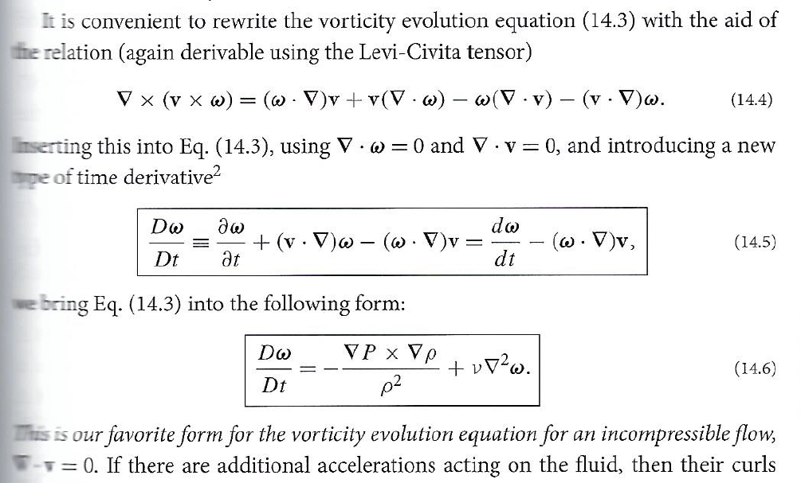
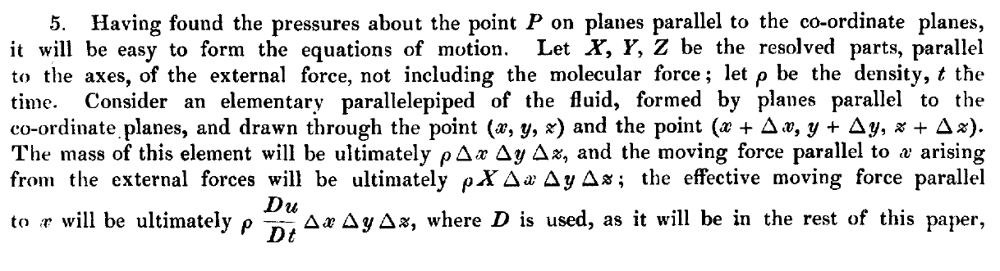
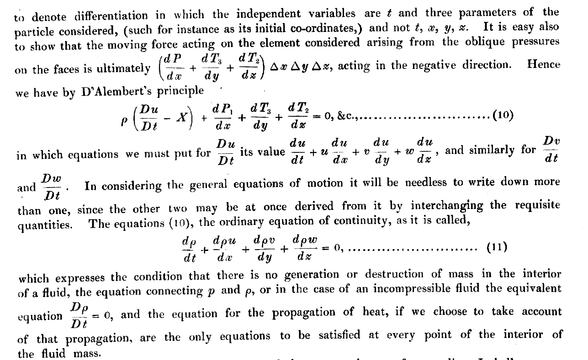

## An Encomium for *D/Dt* Notation

In this panegyric, I discuss Sir George Gabriel Stokes' *D/Dt* notation for the material derivative, and defend it against Nobel-Prize wielding arrivistes.  Of course, disagreements about notation are among the most pointless in science, so please regard this essay for its entertainment value only.  Shameless appeals to authority, as exercised below, have no place in actual scientific disagreements, but remain in fashion for mock disputes.  I have included excerpts from several key texts, and I apologize for the poor quality of the scans.

&emsp; -- Christopher Tong, Ph.D. (physics).

### The Material Derivative

One of any student's first lessons in fluid dynamics is the use, in D'Alembert-Euler local field theory, of a total derivative known as the *material derivative*,
*convective derivative*, or *substantive derivative*.  For instance the classic monograph by Sir Horace Lamb (1932, sec. 5) includes the following.

Lamb used the *D/Dt* notation introduced by Stokes himself, in the paper where he gives the essentially modern continuum derivation of the Navier-Stokes equations (Stokes, 1849, Sec. 5; see my *Appendix* below).  Other authors use either *d/dt* or *D/Dt* for this concept.  Batchelor (1967, sec. 2.1), for instance, has this passage.

Lord Rayleigh (1916), who later won the 1904 Nobel Prize in Physics, also used the *D/Dt* notation.  Tritton (1988, Sec. 5.5), Faber (1995, Sec. 2.4), and Rieutord (2015, sec. 1.3.4) have entire sections dedicated to the material derivative, which I won't quote here; they all also use the *D/Dt* notation for it.  The *Feynman Lectures* have a nice derivation of this expression in [Chapter 40](https://www.feynmanlectures.caltech.edu/II_40.html) (Sec. 2), which you can read for free.  However, Feynman does not use any special notation for the material derivative, nor do Subramanyan Chandrasekhar (1961) and Steven Weinberg (2021, sec. 2.5).

A particularly insightful passage on this notation is provided by Sir James Lighthill, who like Stokes, was a holder of Sir Issac Newton's Lucasian Chair of Mathematics at Cambridge University.  Lighthill (1986, Sec. 3.1) writes:

Here Lighthill defends the use of *D/Dt* rather than *d/dt* for this use in fluid dynamics.  However, many key writers, including Alfven (1942) and Landau & Lifshitz (1959), continued to use *d/dt* instead of *D/Dt*.  Paradoxically, though Prandtl (1952) uses *d/dt*, Prandtl and Tietjens (1934, sec. 49) use the hybrid notation *D/dt*.  The latter convention is also adopted briefly by Rajeev (2018), though most of the time he just writes out the full expression in tensor notation.

### The "Fluid Derivative"

Kip Thorne and Roger Blandford, in their *Modern Classical Physics* (2017), also use *d/dt* for the material derivative, but go one step further.  See this excerpt from Sec. 14.2.1:

Their footnote 2 indicates that "The combination of spatial derivatives appearing here is called the *Lie derivative*", and that it is the commutator of the velocity and vorticity vectors, an operator "often encountered in differential geometry."  They provide alternate notations for the Lie derivative, either a capital script "L" with a subscript "v", or commutator brackets.
They go on to use the term "fluid derivative" for their expression 14.5 when acting on a vector (and when acting on a scalar, they state is it just the convective derivative).  Finally they parenthetically (and dismissively) note that "The notation *D/Dt* is used in some older texts for the convective derivative *d/dt*."  Excuse me?  I have never seen any other text use *D/Dt* for expression 14.5.  Thorne and Blandford have appropriated Stokes' notation for an expression other than what Stokes (and generations of authors after him) intended.  As far as I can tell, this usage is unique to Thorne and Blandford.

I predict that Thorne and Blandford's revisionist notation will not catch on.  The *D/Dt* notation for the material derivative is too entrenched, and for good reason (as the Lighthill passage indicates).  Thorne and Blandford's "fluid derivative" could easily be denoted as the sum of *D/Dt* and the Lie derivative (or equivalently the commutator of the velocity and vorticity vectors).

Won't you join me in the Campaign to Save Stokes' *D/Dt*?  

;-)

### Appendix:  Stokes himself

This is an excerpt from Stokes (1949) where *D/Dt* first appears.

 

The use of a capital *D* as a differential operator in hydrodynamics is actually older than Stokes.  Joseph-Louis Lagrange introduces such an operator in volume 2, Section XI, subsection 1, of *Mecanique analytique, novelle edition* (1811), but it appears to mean something different than Stokes' meaning.

To add to the confusion, in general relativity, the *covariant derivative* is sometimes denoted using a capital *D* operator as well.

### References

H. Alfven, 1942:  Existence of electromagnetic-hydrodynamic waves.  *Nature*, 150:  405-406.

G. K. Batchelor, 1967:  *Introduction to Fluid Dynamics*.  Cambridge University Press.

S. Chandrasekhar, 1961:  *Hydrodynamic and Hydromagnetic Stability*.  Inernational Series of Monographs on Physics.  Oxford University Press.  Reprinted by Dover, 1981.

T. E. Faber, 1995:  *Fluid Dynamics for Physicists*.  Cambridge University Press.

H. Lamb, 1932:  *Hydrodynamics*, 6th edition.  Cambridge University Press.  Reprinted with a forward by R. A. Caflisch, 1997.

J. L. Lagrange, 1997:  *Analytical Mechanics*, translated from the *Mecanique Analytique, novelle edition* of 1811.  Translated and edited by A. Boissonnade and V. N. Vagliente.  Boston Studies in the Philosophy of Science, vol. 191.  Kluwer.

L. D. Landau and E. M. Lifshitz, 1959:  *Fluid Mechanics*.  Course of Theoretical Physics, vol. 6.  Pergamon Press.

J. Lighthill, 1986:  *An Informal Introduction to Theoretical Fluid Mechanics*.  IMA Monograph Series, vol. 2.  Oxford University Press.

L. Prandtl, 1952:  *Essentials of Fluid Dynamics, With Applications to Hydraulics, Aeronautics, Meteorology and other Subjects*.  Hafner.

L. Prandtl and O. G. Tietjens, 1934:  *Fundamentals of Hydro- and Aeromechanics*.  Engineering Societies Monographs.  McGraw-Hill.  Reprinted by Dover, 1957.

S. Rajeev, 2018:  *Fluid Mechanics: A Geometrical Point of View*. Oxford University Press. 

Lord Rayleigh, 1916: On convection currents in a horizontal layer of fluid when the higher temperature is on the under side. *Philosophical Magazine*, series 6, 32: 529-546.

M. Rieutord, 2015:  *Fluid Dynamics:  An Introduction*.  Graduate Texts in Physics.  Springer.

G. G. Stokes, 1849:  On the theories of the internal friction of fluids in motion, and of the equilibrium and motion of elastic solids.  *Transactions of the Cambridge Philosophical Society*, 8: 287-305.  (Presented in 1845.)

K. S. Thorne and R. D. Blandford, 2017:  *Modern Classical Physics:  Optics, Fluids, Plasmas, Elasticity, Relativity, and Statistical Physics*.  Princeton University Press.

S. Weinberg, 2021:  *Foundations of Modern Physics*.  Cambridge University Press.

[Return to main page](https://hydrodynamicstability.github.io/Invitation-to-Hydrodynamics/)

#### Disclaimers

The content on this site was developed solely on my personal time. The views expressed are solely my own, and do not necessarily represent the views, policies, or opinions of my employer or any organization with which I am affiliated.

(c) 2022 by Christopher Tong.  
