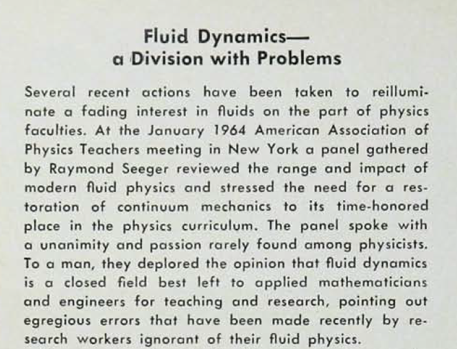

## An Invitation to Fluid Mechanics for Physicists

"Hydrodynamics and magnetohydrodynamics are fundamental, regardless of popular opinion."  

&emsp; -- [Eugene N. Parker](https://news.uchicago.edu/story/eugene-parker-legendary-figure-solar-science-and-namesake-parker-solar-probe-1927-2022) (1927-2022)\*

&emsp; &emsp; &emsp; \*Quoted in the retrospective by Stuart D. Bale, *Science*, 376:  461 (29 Apr 2022).

"That we have written an equation does not remove from the flow of fluids its charm or mystery or its surprise."  

&emsp; -- [Richard P. Feynman](http://www.richardfeynman.com/about/bio.html) (1918-1988)\*\*

&emsp; &emsp; &emsp; \*\* *The Feynman Lectures in Physics*, vol. 2, ch. 41.  (Addison-Wesley, 1964.)

"The older I get, the stranger it seems to me that my undergraduate education in physics and astronomy included virtually no instruction in fluids.  I suspect I am not the only physicist who feels that way." 

&emsp; -- [Chanda Prescod-Weinstein](http://www.cprescodweinstein.com/)\*\*\*

&emsp; &emsp; &emsp; \*\*\* *Physics Today*, July 2022, p. 53.

**Welcome.**  This site aims to outline why a physicist should learn a little bit of fluid mechanics, and how to get started doing so.   It exists because the subject is usually completely neglected in the standard physics curriculum.  The site is currently under construction; thank you for your patience.  To further develop this site, comments and collaboration from others (physicists or otherwise) is welcome.  We physicists have a poor track record teaching hydrodynamics, as sadly documented elsewhere on this site.  Like T. E. Faber I am but an "enthusiastic amateur" in this arena, so constructive criticism is always and humbly welcome.
&emsp; -- Christopher Tong, Ph.D. (physics).

**Outline:**
- Why should a physicist learn some fluid mechanics?
- Intrigued, but not yet ready to commit?
- Convinced, and ready to take the plunge?
- Some background thoughts
- Some favorite fluid mechanics pieces in *Physics Today*
- Companion pages

### Why should a physicist learn some fluid mechanics?

- To use it in their work:

  - Experimentalists in any field of physics may need to deal with hydrodynamic, hydraulic, or pneumatic issues when designing or maintaining apparatus, or even for the experiments themselves.  Example:  Robert Millikan's famous [oil drop experiment](https://doi.org/10.1103/PhysRev.2.109) required the use of Stokes' formula for the drag force on a slowly falling sphere.  (He included a first-order correction to the Stokes formula to account for the diameter of the oil drop being of the same order of magnitude as the mean free path of a gas molecule.)
  
  - Theorists might be inspired to use a fluid model for some other physical phenomenon.  Example:  George Gamow's influential [liquid drop model of the nucleus](https://doi.org/10.1098/rspa.1930.0032), developed further by Bohr, Heisenberg, von Weiszacker, and Wheeler, and used by Meitner & Frisch to [explain nuclear fission](https://www.atomicheritage.org/key-documents/meitner-frisch-nuclear-fission).

  - Wide applications *within* physics, including plasma physics, astrophysics & cosmology, condensed and soft matter physics, and hybrid fields such as physical chemistry, biological physics, and environmental science and engineering.  
  
  - Crucial subject for the study of geophysics, atmosphere and ocean dynamics, hydrology, and all their counterparts in planetary physics.  

  - Applications across engineering and technology, including civil, chemical, biomedical, mechanical, and aerospace engineering, but even occasionally in electrical and nuclear engineering, and materials science and engineering.  Closely allied fields include acoustics and rheology.

- For its own sake:

  - "\[T\]here are so many curious and beautiful natural phenomena, visible every day in the world about us, which a physicist with no knowledge of fluid mechanics is unable to appreciate in full."  -- Thomas E. Faber, *Fluid Dynamics for Physicists* (Cambridge University Press, 1995).

  - "\[A\]t present, fluid mechanics is one of the most actively developing fields of physics, mathematics and engineering, so you may wish to participate in this exciting development."  -- Gregory Falkovich, *Fluid Mechanics:  A Short Course for Physicists* (Cambridge University Press, 2011).

Some additional reasons physics *students* should consider learning some fluid mechanics:

- It's an excellent arena to practice working with vector calculus, partial differential equations, and other mathematical (and computational) methods.

- Even more important, it is an excellent arena in which to practice using dimensional analysis, scaling arguments, and other tools of physical intuition.

- "\[M\]ost other subjects in the physics curriculum are almost exclusively concerned with *linear* processes, whereas fluid dynamics leads one into the *non-linear* domain."  -- Thomas E. Faber, *Fluid Dynamics for Physicists* (Cambridge University Press, 1995).

- As James S. Trefil has argued, many physicists end up pursuing careers in fields beyond conventional physics research, and should be educated as generalists.  "This point was brought home to me most forcefully when I became involved in some interdisciplinary research projects in medicine, and discovered to my chagrin that I did not possess the background necessary to make meaningful contributions in many areas of the research."  -- James S. Trefil, *Introduction to the Physics of Fluids and Solids* (Pergamon, 1975; reprinted by Dover, 2010).

- [Ben Korgen](https://physicstoday.scitation.org/doi/full/10.1063/1.1839379) argues that atmosperic science, oceanography, and geophysics are socially relevant subjects, and that physics majors are a preferred source of students for graduate programs in these fields, but that without fluid mechanics, their physics education condemns them to require remedial coursework in it.

### Intrigued, but not yet ready to commit?

Here are a few sampler dishes to see if you like it.  Effort increases as you work your way down the list.

- Watch this 46-minute video lecture, [Why Hydrodynamics?](https://podcasts.ox.ac.uk/why-hydrodynamics) by Prof. Steve Simon, a condensed matter theorist at Oxford University.  It's a nontechnical talk aimed at fellow physicists.  
 
- Read the fluid mechanics chapters (vol. 2, ch. 40-41) of the [Feynman Lectures on Physics](https://www.feynmanlectures.caltech.edu/), to find out what Richard Feynman wanted every physics undergraduate to know about fluid mechanics.  This is about 24 pages of material.

- Read the first chapter of T. E. Faber's *Fluid Dynamics for Physicists* (Cambridge University Press, 1995).  Several writers have praised the first chapter, "A bird's eye view", as an overview of hydrodynamic problem solving, using the example of ejecting liquid from a syringe.  This is 36 pages of material.

- Read geophysicist Grae Worster's little book, *Understanding Fluid Flow* (AIMS Library Series, Cambridge University Press, 2009).  In 100 pages you will gain a quick tour of some of the prominent ideas of the subject, and a flavor of what it's like to study it.

In addition, check out the [F\*ck Yeah Fluid Dynamics](https://fyfluiddynamics.com/) blog, which is a completely nontechnical, often whimsical take on fluid physics, run by aerospace engineer Dr. Nicole Sharp.

### Convinced, and ready to take the plunge?

Some of you will be ready to crack open Landau & Lifshitz's *Fluid Mechanics*, part of which represents their (very demanding) "theoretical minimum".  For most of you, starting there would be unwise; a friendlier introduction might be in order.  I discuss books on fluid and continuum mechanics written by physicists on a [companion page](booksByPhysicists.md).  Please consult that list, as it is of great value to read how fellow physicists view the subject.  Having said that, **hydrodynamics is an interdisciplinary field**, and some of the finest literature in it has been written by others, deserving of your attention.  Below I will enumerate some books by non-physicists that physicists often recommend.  A personal favorite is by the late oceanographer, Pijush K. Kundu (1941-1994):
- P. K. Kundu, 1990:  *Fluid Mechanics*, 1st edition (Academic Press).

This was my primary text when I began learning the subject in the summer of 1996, and subsequent experience has convined me that it remains one of the finest first books on the subject one can learn from.  I am unable to vouch for later editions of the book, which were prepared by other authors after Kundu's passing.  Physicist [Raymond A. Shaw](https://doi.org/10.1119/1.4929153) has used the original edition, but would not use the later ones.

I will divide the other books into two categories:  those by applied mathematicians and those by engineers.

  - Books by applied mathematicians:
    - David J. Acheson, 1990:  *Elementary Fluid Dynamics* (Oxford University Press).
    - Alexandre J. Chorin and Jerrold E. Marsden, 2000:  *A Mathematical Introduction to Fluid Mechanics*, 3d edition (Springer).  The first author was awarded the National Medal of Science for his contributions to hydrodynamics.
    - A. R. Paterson, 1983:  *A First Course in Fluid Dynamics* (Cambridge University Press).
  - Books by engineers:
    - Rutherford Aris, 1989:  *Vectors, Tensors, and the Basic Equations of Fluid Mechanics*, corrected reprint (Dover).
    - Rolf H. Sabersky, Allan J. Acosta, Edward G. Hauptmann, and E. M. Gates, 1999:  *Fluid Flow: A First Course in Fluid Mechanics*, 4th edition (Prentice Hall).  \[Out of Print\]
    - Alexander J. Smits, 2022:  *A Physical Introduction to Fluid Mechanics*, 2d edition (available [online](http://www.efluids.com/efluids/books/efluids_books.htm)).  The first edition was published by Wiley in 1999.  This author is the 2020 Batchelor Prize laureate (one of the highest honors in fluid dynamics research).
    - Frank M. White and Henry Xue, 2021:  *Fluid Mechanics*, 9th edition (McGraw-Hill).  

I will also mention a few more advanced books that any serious student of the subject should consider:

  - George K. Batchelor, 1967:  *An Introduction to Fluid Dynamics* (Cambridge University Press).  If hydrodynamics has a bible, this is it!
  - M. James Lighthill, 1986:  *An Informal Introduction to Theoretical Fluid Mechanics* (Oxford University Press).  This author once held Sir Isaac Newton's post at Cambridge University (the Lucasian Professorship of Mathematics).
  - Ronald L. Panton, 2013:  *Incompressible Flow*, 4th edition (Wiley).

Some perceptive thoughts on books for physicists to use when teaching fluid mechanics are offered by Raymond A. Shaw's [review](https://doi.org/10.1119/1.4929153) of the second edition of *Physical Hydrodynamics* by Guyon et al. in the *American Journal of Physics* (2015).  Shaw's short review should be required reading for everyone visiting this page 🙂.

Fluid mechanics is an inherently visual discipline.  Some multimedia resources include:
- The American Physical Society's Division of Fluid Dynamics (DFD) hosts an annual event called the *Gallery of Fluid Motion*, which can now be accessed [online](https://gfm.aps.org/).
- Cambridge University Press offers *Multimedia Fluid Mechanics*, also [online](https://www.cambridge.org/core/homsy/) but behind a paywall.  This is one of the most popular resources for fluid mechanics teaching.
- Prof. Jean Hertzberg (U. Colorado-Boulder)'s course on [Flow Visualization](https://www.flowvis.org/).
- Prof. Fanette Chassagne (at the time at U. Washington Seattle) posted a high quality [scan](https://courses.washington.edu/me431/handouts/Album-Fluid-Motion-Van-Dyke.pdf) of the out-of-print classic *An Album of Fluid Motion* by Milton Van Dyke (Parabolic Press, 1982).
- Two classic series of fluid mechanics instructional films are those of Prof. Ascher Shapiro (MIT), the [National Committee for Fluid Mechanics Films](https://web.mit.edu/hml/ncfmf.html); and those of Prof. Hunter Rouse (U. Iowa), at the [Iowa Institute for Hydraulic Research](https://www.iihr.uiowa.edu/rouse-educational-films/).  Shapiro's series includes distinguished presenters such as G. I. Taylor, James Lighthill, John Lumley, Hershel Markovitz, and Dave Fultz.  (Some users might prefer [this link](https://hml.mit.edu/ncfmf) for the Shapiro film series.)
- An example of a more contemporary video approach is the [Physics4Life](https://www.youtube.com/c/Physics4Life) channel of Princeton physicist Katerina Visnjic.  She has a set of three videos on hydrostatics and pressure that I highly recommend, including an enactment of Pascal's "exploding barrel" experiment.
- An online portal for all things fluid mechanical is [eFluids](http://www.efluids.com/).  While it probably falls short in its goal to be a "one stop source for fluid dynamics and flow engineering", it is still a useful resource, and I know of nothing else even close to it on the web.

If you're ready to find out what kinds of contemporary research in fluid mechanics are taking place, there are plenty of options.  If you attend the American Physical Society (APS)'s March Meeting, you can easily drop into sessions co-sponsored by the APS Division of Fluid Dynamics (DFD) there.  When you get more serious, the APS-DFD annual meeting is usually right before Thanksgiving.  This is the most important fluid dynamics conference in the U.S., and the home of the *Gallery of Fluid Motion*.  You will find that physicists are in the minority at this conference :smile:.  The American Meteorological Society (AMS) hosts its *Atmospheric and Oceanic Fluid Dynamics* conference every other year, and the AIAA used to run another major annual fluid dynamics conference.  Indeed, most of the engineering society conferences will have talks on hydraulics/hydrodynamics.  For instance, I've been fortunate to attend biomedical engineering conferences organized by both ASME and IEEE, and found plenty of biological fluid dynamics content at both.  Internationally, keep an eye on events sponored by IUTAM (International Union of Theoretical and Applied Mechanics), EUROMECH (European Mechanics Society), and the Japan Society of Fluid Mechanics.

You can also start browing the field's journals.  I recommend starting with the venerable review journal, the *Annual Review of Fluid Mechanics*.  Founded in 1969 under first editor William Sears, and associate editor Milton van Dyke, this is a treasure-chest of the hydrodynamics community.  The leading research journal is Cambridge University Press' *Journal of Fluid Mechanics* (JFM), founded by George Batchelor in 1956.  It has recently been joined by a sibling journal, *Flow:  Applications of Fluid Mechanics*.  For many years, the American Institute of Physics' journal *Physics of Fluids* was published in coordination with APS-DFD.  Founded in 1958 under first editor Francois Frenkiel, the journal was forsaken by the DFD at the end of 2015, when DFD launched the competing *Physical Review Fluids*, published by the APS itself.  Other notable journals include a trio of complementary Springer titles: *Experiments in Fluids*, *Theoretical and Computational Fluid Dynamics*, and *Journal of Mathematical Fluid Mechanics*;  the Japanese journal *Fluid Dynamics Research*, and EUROMECH's *European Journal of Mechanics B/Fluids*.  There are also more specialized journals in computational fluid dynamics, heat and mass transfer, rheology, and so on.  Readers of this page may find the boutique journal *Geophysical and Astrophysical Fluid Dynamics* of particular interest.  Of course, fluid mechanics research often appears in the journals of the engineering societies, as well as more general physics, math, and geoscience journals.

### Some background thoughts

Fluid mechanics consists of the statics and dynamics of fluids (hydrostatics and hydrodynamics, respectively), classically including liquids, gases, and plasmas.  *Fluids* are materials characterized by continuous deformation in response to tangential force.\*  The same macroscopic laws of fluid mechanics are operative despite fundamentally different microscopic physics governing these states of matter, perhaps a clue that fluid mechanics is an [emergent phenomenon](https://www.pnas.org/doi/10.1073/pnas.97.1.28).  These macroscopic laws were developed primarily in the 18th and 19th centuries, well before the general acceptance of the atomic hypothesis, and have scarcely needed revision since then.  Nonetheless, a number of *fundamental* problems involving fluid dynamics remains unsolved, and there is a wide range of applications throughout science, engineering, and medicine.

In classical mechanics, we typically study point particles, systems thereof, and rigid bodies.  However, an oft-neglected feature of mechanics in today's physics curriculum is *continuum mechanics*, the statics and dynamics of deformable solids and fluids, as well as materials with more complex rheology.  The classical theory of continua makes use of both the continuum hypothesis (ignoring the discrete molecular structure of matter) and the assumption of local thermodynamic equilibrium.  In fluid dynamics, the bulk transport of mass, momentum, and heat are nonequilibrium phenomena, but we posit the existence of scalar, vector, and tensor fields where mechanical variables (like velocity and stress) and thermodynamic variables (like density, pressure, and temperature) can be *locally* well defined, even as they vary globally in space and time.  In kinetic theories of gases, however, it is possible to derive the classical equations of hydrodynamics as approximations to the Boltzmann transport equation for, e.g., dilute monatomic gases with conservative binary collisions.  The approximation is often based on decomposing the number density distribution function in state space as the sum of a Maxwell-Boltzmann distribution and a small deviation, and expanding the collision integral to first order in that deviation.  Thus while hydrodynamics is usually considered a branch of mechanics, it has intimate connections with statistical mechanics and nonequilibrium thermodynamics, dating back to the founding of both hydrodynamics and the kinetic theory of gases by Daniel Bernoulli in 1738.

[Fluid dynamics](https://engage.aps.org/dfd/home) is often divided into incompressible and compressible flows (the latter is sometimes termed "gas dynamics").  The transmission of sound waves in fluids is a link between compressible hydrodynamics and [*acoustics*](https://acousticalsociety.org/), another neglected topic of classical physics in the contemporary curriculum.   Less neglected is *magnetohydrodynamics*, the extension of hydroynamics to electrically conducting fluids in the presence of magnetic fields, an often useful approximation in plasma physics, astrophysics, and cosmology (where relativistic fluid dynamics may also be considered).  More specialized subjects include electrohydrodynamics (charged fluid in an electrostatic field, receiving recent attention in microfluidics) and ferrohydrodynamics (magnetic fluids often in the absence of either electric charge or current).  Meanwhile the inherently quantum mechanical phenomenon of superfluidity (e.g., liquid helium-3’s and -4’s superfulid states, and Bose-Einstein condensates formed from dilute alkali atomic gases) have been the source of multiple Nobel Prizes in Physics.  (It is even claimed that superfluids can form in the cores of neutron stars.)

Much of classical hydrodynamics focuses on *Newtonian* fluids, for which a linear relationship exists between the stress tensor and velocity gradients; *Non-Newtonian* fluids have a more complex relationship between stress and response.  [*Rheology*](https://www.rheology.org/SoR/) is the study of such fluids.  For Newtonian fluids, the classical equations of hydrodynamics include the *continuity equation* (mass balance) and the *Navier-Stokes equations* (momentum balance).   (The special case of inviscid flow is described by the *Euler equations*, the Navier-Stokes equations without the viscous terms.)  The *no-slip* condition is the most important boundary condition for viscous flow.  As Oxford theoretical physicist Julia Yeomans [reminds](https://www.nature.com/articles/s41567-021-01258-4) us, we celebrate the 200th anniversary of the Navier-Stokes equations in 2022 (the year this site went live).  While some analytical solutions can be derived, in most realistic problems the equations must be solved numerically.  Computational fluid dynamics (CFD) is one of the oldest domains of computational physics, and the arena of much applied research, and engagement with yet another discipline, computer science and engineering.  For mathematicians, the Navier-Stokes equations are the focus of [one](https://www.claymath.org/millennium-problems/navier%E2%80%93stokes-equation) of the seven Clay Mathematics Institute's Millenium Prizes.  (The simplest constitutive laws for the diffusion of heat and solute concentration in fluids are those of Fourier and Fick, respectively, and can be incorporated in convection equations that supplement the Navier-Stokes.)

I have already mentioned several of the dualisms involved in fluid and flow physics:  Newtonian vs. non-Newtonian, inviscid vs. viscous, and compressible vs. incompressible.  Richard W. Johnson, in his *Handbook of Fluid Dynamics* (CRC Press, 1998) reminds us of several others:  laminar vs. turbulent, single-phase vs. multi-phase, single-component vs. multicomponent, and reacting vs. non-reacting.  In engineering, flow phenomena are part of the larger study of transport phenomena (e.g., the bulk transport of mass, momentum, and heat).  Meanwhile hydrodynamic instabilities and the transition to turbulence provide links between fluid dynamics and other subdisciplines of physics, including nonlinear dynamics and chaos, complex systems, and pattern formation.  An idiosyncratic list of other hydrodynamic topics includes combustion, flow in porous media (in which Darcy's Law is the most famous result), micro- and nano-fluidics, bubbles and cavitation, foams, fluid-structure interaction, interfacial fluid mechanics and thin films, surface tension and capillary effects, suspensions, and sedimentation.

Fluid dynamics is of increasing interest in condensed and soft matter physics, biological and medical physics, and environmental physics.  The subject has historically even deeper connections to applied mathematics, physical chemistry, all the geophysical, atmospheric, oceanic, and planetary sciences, and to civil, mechanical, aerospace, chemical, and biomedical engineering, among others.  In fact it could be argued that civil engineers were the first hydrodynamicists, since all ancient civilizations were founded on river banks, and they collectively needed to solve the problems of irrigation, drainage, and flood control.  By that argument, the study of fluid flow is as old as human civilization itself.

\* Fluids also respond to normal forces, but so do Hookean solids.  Rheologists would point out that real solid materials might also deform in response to a tangential force, perhaps upon reaching a threshold (classical plasticity) or when observed for a sufficiently long time (such as glacial ice flows).

### Some favorite fluid mechanics pieces in *Physics Today*

- Jerry Gollub:  Continuum mechanics in physics education.  Dec. 2003, pp. 8-9.
  - A primary inspiration for this website!
- Ben J. Korgen:  Let's revive the study of fluids!  Nov. 2004, pp. 60-61.
  - Adds to Gollub's arguments above.
- John D. Anderson, Jr.:  Ludwig Prandtl's boundary layer.  Dec. 2005, pp. 42-48.
  - Superb retrospective by an eminent historian of aerodynamics.
- Jerry Gollub:  Discrete and continuum descriptions of matter.  Jan. 2003, pp. 10-11.
  - Discusses granular flows and particle-laden flows, problems that require a combination of discrete and continuous modeling.
- M. James Lighthill:  Fluid dynamics as a branch of physics.  Feb. 1962, pp. 17-20.
  - Irreverent after-dinner speech on the history of hydrodynamics at the APS-DFD 1960 annual meeting in Baltimore.
- Marcus Reiner:  The Deborah number.  Jan. 1964, p. 62.
  - Amusing story of the founding of rheology and using the Deborah number to distinguish between solid and fluid.
- Hershel Markovitz:  The emergence of rheology.   April, 1968:  pp. 23-30.
  - History of constitutive laws in continuum mechanics and rheology.
- Russell J. Donnelly:  The discovery of superfluidity.  July, 1995:  pp. 30-36.
  - History of early experiments on liquid helium superfluids, from Heike Kamerlingh Onnes to the Toronto group to Pyotr Kapitsa.
  
Speaking of *Physcs Today*, check out this lamentation, an excerpt from a sidebar in a *Physics Today* article by Richard G. Fowler (June, 1966; pp. 37-42) summarizing a joint meeting between APS and the Japanese Physical Society:

Alas, a similar panel could easily be held today, except (1) there would be women, not just men, and (2) they might also have to point out the "egregious errors" in fluid physics made by physicists themselves!

### Companion pages

- [Books on fluid and continuum mechanics written by physicists](booksByPhysicists.md).
- [Fluid mechanics in the physics curriculum](curriculum.md).
- [Continuum mechanics in the great physics courses](physicscourses.md).
- [Fluid mechanics and the history of physics](histphysics.md).
- [An encomium for *D/Dt* notation](DbyDt.md) (tongue-in-cheek).

### Acknowledgments

I am grateful to Dr. Linda St-Cyr for providing feedback on this site.

#### Disclaimers

The content on this site was developed solely on my personal time.  The views expressed are solely my own, and do not necessarily represent the views, policies, or opinions of my employer or any organization with which I am affiliated.

(c) 2022 by Christopher Tong
