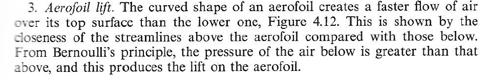

## Fluid Mechanics in the Physics Curriculum

"The integration of continuum mechanics into the physics curriculum could yield many benefits.  I do not presume that this integration would have to occur as a single separate course.  Greater attention to this field could be distributed in various parts of the undergraduate and graduate curricula, including courses in classical mechanics, condensed matter physics, and so on."

  -- [Jerry P. Gollub](https://www.haverford.edu/college-communications/news/jerry-gollub-1944-2019) (1944-2019)\*

      \* *Physics Today*, 56 (12):  10-11 (2003).

"The hydrodynamic equations are often closely analogous to the electrodynamic equations; that’s why we studied electrodynamics first. Some people argue the other way; they think that one should study hydrodynamics first so that it will be easier to understand electricity afterwards. But electrodynamics is really much easier than hydrodynamics."  

  -- [Richard P. Feynman](http://www.richardfeynman.com/about/bio.html) (1918-1988)\*\*

      \*\* *The Feynman Lectures in Physics*, vol. 2, ch. 40.  (Addison-Wesley, 1964.)

"We regard the transport phenomena course as a third semester of physics, made necessary by the fact that elementary physics includes almost no material on fluid dynamics, heat conduction, and diffusion."

  -- [R. Byron Bird](https://engineering.wisc.edu/news/chemical-engineering-pioneer-robert-byron-bird-passes-away-at-96/) (1924-2020)\*\*\*

      \*\*\* *Chemical Engineering Education*, Winter 1968, pp. 4-7.

**Welcome.**  In the following, I discuss encounters with fluid mechanics, as it appears in textbooks intended for major subjects in the core undergraduate and graduate physics curriculum.  This page is a work in progress; I appreciate your patience.

  -- Christopher Tong, Ph.D. (physics).

### Introductory physics

Nearly every introductory physics text includes coverage of fluid mechanics.  Conventional topics include density; pressure, its measurement, and its variation with depth/altitude; Pascal's Principle; buoyancy and Archimedes' Principle; classification of fluid flows; streamlines and the hydraulic continuity equation; the Bernoulli equation; the Venturi effect; Torricelli's efflux problem; and viscosity and the Reynolds Number.  Sometimes surface tension and capillarity; Poiseuille flow; aerodynamic lift and drag; and the Magnus effect are also discussed.  

The Bernoulli equation and aerodynamic lift are particularly tricky topics that some texts foul up.  A number of older texts incorrectly attributed aerodynamic lift solely to the cambered profile of an airfoil, without noting (by Newton's third law) that there must be a downward force (and thus deflection) on the air flowing around the airfoil.  Here is a typical example from Nelkon & Parker (1995, Ch. 4, pp. 127-128):

 

  
The streamlines under the airfoil appear to be almost completely horizontal; without an angle of attack, this profile cannot generate any lifting force!  While most well designed airfoils have camber, this design element is intended to enhance lift generated by flying at a nonzero angle of attack, rather than being the primary source of lift.  As Alexander (2009) notes,

"Airplane designers are intensely interested in how much lift a wing produces under different conditions, one of which is called the angle of attack--the angle between the wing and the direction it moves through the air....Camber can increase the amount of lift that a wing produces at any given angle of attack without much increase in drag....In fact, more than a few airplanes fly with zero-camber airfoils, usually called symmetrical airfoils.  Many supersonic airplanes have symmetrical airfoils, as did at least one Second World War fighter (the Bell P-39 Airacobra) and one small jet airliner (the Fokker F-28 Fellowship).  A wing with a symmetrical airfoil can still produce lift; it just does so entirely with angle of attack....Aerobatic airplanes that need to be able to fly equally well when they are upside down and right side up (such as the Pitts Special) also use zero-camber wings.  These airplanes often compensate for slightly less efficient wings with significantly more powerful engines."

When I was a graduate teaching assistant in the late 1990s, I encountered a more elementary error.  Halliday, Resnick, & Walker (1997, vol. 2, chapter 15) include the following homework problems.

These problems are meant to be solved using Bernoulli's equation for streamlines, but this requires you to tacitly assume that there is a streamline connecting the air outside the building with air inside the building.  However, typically the outside air's streamlines will be flowing *around* the building, not through it.  I am tempted to call this bad physics, an example of what [R. A. Shaw](https://doi.org/10.1119/1.4929153) called the "often over-simplified and even misleading treatments of mass continuity and the Bernoulli equation in introductory physics courses."  Jerry Gollub (2008)'s condemnation is decisive:  "The single largest difficulty I have encountered in incorporating fluid mechanics into introductory physics courses is that standard textbooks do a poor job in covering fluids."

### Classical mechanics

When I was an undergraduate in the early 1990s, most intermediate mechanics texts omitted fluids entirely.  Symon (1971, Ch. 8) and Arya (1997, Ch. 15) were two exceptions, both including a chapter on the mechanics of continuous media, consisting of vibrations on strings as well as fluid dynamics and sound waves.  Corben and Stehle (1994, Sec. 81) devote less space to fluid dynamics, but at least they include the Navier-Stokes equations as a "special application".  Fowles & Cassiday (2005) include a section (2.4) on "Velocity-dependent forces:  fluid resistance and terminal velocity", which considers a drag force that has linear and quadratic terms in velocity.  They do not derive the general equations of fluid motion.

At the graduate level, the texts of Fetter &  Walecka (1980) and Jose & Saletan (1998, Sec. 9.5) are notable examples that include fluid dynamics.  Fetter & Walecka are particularly praiseworthy for celebrating the whole of continuum mechanics in the entire second half of their book (Ch. 7-13); Jose & Saletan's Chapter 9 is similarly devoted to continuum mechanics.  Both books derive the basic field equations (contuinuity, and Euler and Navier-Stokes) and discuss surface waves; Fetter and Walecka also cover sound and shock waves; while Jose and Saletan include the Burgers and KdV equations.  Otherwise, graduate-level mechanics books touch on fluid flow only as an analogy with the Liouville theorem (e.g., Goldstein, et al, 2001; Hand and Finch, 1998).  Uniquely among such texts, Appendix 2 of the classic Arnol'd (1989) discusses the formal correspondence between the Euler equations of rigid body dynamics and the Euler equations of ideal fluid flow.  

Generally though, Jerry Gollub (2003) was correct when he wrote that "The most popular textbooks intended for courses in classical mechanics do not generally treat fluid or solid mechanics. It is hard to teach courses that are not adequately supported by textbooks, especially at the undergraduate level."  Gollub himself used the undergrad intermediate mechanics course to introduce fluid dynamics to his physics students.

In the years since then, more undergraduate mechanics texts are including chapters on fluid dynamics, though many of the most popular texts continue to competely ignore the topic.  The final chapter of the popular text by Taylor (2005, Ch. 16) covers continuum mechanics, emphasizing solid mechanics, with the very brief sections on fluid mechanics marked optional.  Other examples include Chaichian et al. (2012, Ch. 6), Deshmukh (2020, Ch. 11), and Hamill (2022, Ch. 19).  At the graduate level, Fasano & Marmi (2006) include a brief final chapter (16) on the Lagrangian formulation of continuum mechanics, covering solid and fluid mechanics, as well as electromagnetism.  

(While not used as a course text, the monograph by Sudarshan and Mukunda (1974, ch. 19) develops fluid mechanics as a Galilean field theory, though this requires restricting the fluid to an invsicid, compressible flow in unrestricted space, without obstacles or body forces.  They develop the Lagrangian, Hamiltonian, and Poisson brackets formulation for both irrotational and general flows.)

### Electricity and magnetism

The now-discarded one-fluid and two-fluid theories of electricity were of great historical importance, but have now been largely forgotten, except insofar as "electron hydrodynamics" can be exhibited in a few specific situations in solid state physics.  Today's curriculum in E&M touches on only one fluid physics subject:  magnetohydrodynamics (MHD).  This topic is understandably ignored in the canon of undergraduate E&M textbooks, with the remarkable but little-known exception of one by astrophysicist Attay Kovetz (2000), who devotes three entire chapters to it (Ch. 14-16).  Another exception is the recent text by Chaichian et al. (2016), which includes a single chapter (ch. 5) on MHD.  In contrast, many graduate level texts do include a few token pages on the subject.  The ubiquitous Jackson (1999) has a single section (7.7) of about 3 pages on MHD, less than the 7-page chapter on the topic in Panofsky and Phillips (2005, Ch. 12).  Remarkably, the brief grad-level text by Melia (2001, Secs. 8.4-8.5) beats them both with just over 8 pages; the author's background as an astrophysicist may explain this.  In contrast, Zangwill (2013) mentions Alfven waves only briefly, in Application 17.1.  Sadly, for many physicists the few pages on MHD in their graduate E&M text are the only ones on any fluid mechanics topic (beyond introductory physics) on their bookshelves.

### Statistical physics

A minority of texts in statistical physics cover fluid flow and transport phenomena, usually from the perspective of kinetic theory.  At the undergraduate level Desloge (1966, Ch. 32), Huang (2010, Ch. 7), and more briefly Reif (1965, Sec. 14.5), are a few examples, but most that I know of are graduate-level texts such as Huang (1987, Ch. 5), Reichl (2016, Ch. 8-9), Robertson (1993, ch. 9), McQuarrie (2000, Ch. 16-19), Le Bellac et al. (2004, Sec. 6.3), Halley (2007, Ch. 10), and Van Vliet (2008, ch. 14).  (McQuarrie was a chemist, but his book was strongly recommended to me by an experimental physicist.)  Kadanoff (2000) briefly discusses hydrodynamics in Sec. 5.4, which mainly focuses on diffusion.  (He presumes that students have studied hydrodynamics in an earlier course, "as part of a traditional physics education", a presumption as unlikely to be true then as it is now.)  Schwabl (2010) includes, in his Appendix H, a "microscopic derivation of the linear hydrodynamic equations", by which he seems to mean diffusion equations.  

What about superfluidity?  At the undergrad level, Kittel & Kroemer (1980) devote a few pages to it at the end of their chapter on Fermi and Bose gases, and Huang (2010, ch. 20) devotes a whole chapter to it.  Again, most examples I know of are at the graduate level, such as Feynman (1998, Ch. 11), Huang (1987, Ch. 13), Reichl (2016, Sec. 8.9), Ma (1985, Ch. 30), and Halley (2007, ch. 10).  Van Vliet (2008) has a chapter (12) on quantum fluids in general.

It could be argued that the study of fluid mechanics naturally belongs with the study of thermodynamics and statistical physics:  Alessandro Bettini (2016) has done exactly that in the second of his four-volume *A Course in Classical Physics*.  

### Nonlinear dynamics

Historically there have many connections between fluid dynamics and nonlinear dynamics, and Gollub (2003) encouraged using this link to teach both.  Unfortunately it is possible to convey many of the key ideas of nonlinear dynamics and chaos theory without explicit reference to the equations of hydrodynamics.  However, the derivation of the famous Lorenz model requires hydrodynamics, as illustrated in Appendix C of Hilborn (2000), Appendix A of Schuster & Just (2005), and in Part II of Fetter & Walecka (2006).  Hilborn's Sec. 11.2 also includes a qualitative discussion of mixing in a two-dimensional flow.

### Mathematical methods 

Hydrodynamics can be a source of examples of mathematical methods in physics, as in Wyld (1976), and can also be used to help explain concepts of vector calculus and conformal mapping, as in Boas (2006).  The classic Morse & Feshbach (1953) include a 20-page section (2.3) on the motion of fluids, but more commonly, hydrodynamics is never explicitly mentioned in the standard textbooks of today.  A recent exeption is the graduate-level text by Vaughn (2007), whose chapter on geometry in physics includes a final section (3.6) on fluid mechanics.  There he defines the Lie derivative, and shows how the continuity equation, Euler equation, and vorticity can be expressed in terms of differential forms.

### Computational physics

Though computational fluid dynamics (CFD) is one of the oldest examples of computational science, it rarely makes an appearance in computational physics courses, perhaps because students do not have the necessary theoretical background.  Notable exceptions that I know of include Pang (2006, ch. 9) and various works by Rubin Landau and collaborators (Landau et al., 2008, ch. 19; Landau et al., 2015, ch. 24-25; Landau and Paez, 2018, ch. 4).  A hydrodynamics problem (steady state flow in 2D) is given as a project for the chapter on elliptic PDEs in Koonin (1986, ch. 6), updated as Koonin & Meredith (1990).  A discussion of lattice gas models of fluid flow is included in Gould et al. (2016, sec. 14.6).  Fluid dynamics are only briefly mentioned in Franklin (2013, Sec. 5.1.5).

Readers of this site will appreciate the following quotation from Landau et al. (2008):

> The mathematical description of the motion of fluids, though not a new subject, remains a challenging one.  The equations are complicated and nonlinear, there are many degrees of freedom, the nonlinearities may lead to instabilities, analytic solutions are rare, and the boundary conditions for realistic geometries (like airplanes) are not intuitive.  These difficulties may explain why fluid dynamics is often absent from undergraduate and even graduate physics curricula.  Nonetheless, as an essential element of the real world that also has tremendous practical importance, we encourage its study.

### Condensed matter physics, soft matter physics

Coverage of hydrodynamics in condensed matter physics texts is hit-or-miss, as many of the standards completely ignore the entire subject, except possibly the topic of superfluidity.  Exceptions that I know of include Chaikin & Lubensky (2000, Ch. 8) and Marder (2010, Ch. 15), both graduate level texts.  Comparing these last two books, while Marder seems to have a more in-depth discussion of superfluid Helium, Chaikin & Lubensky's treatment is substantially longer overall, and more directly pursues the unique approach of a condensed matter physicist to hydrodynamics, as opposed to the very classical continuum approach I have generally taken on this site.  At the undergraduate level, Sidebottom (2012) has a brief section on "Hydrodynamic modes in liquids" (Sec. 9.1.3).

Discussion of fluids, often with more interesting rheology than classical Hookean solids and Newtonian fluids, is more common in texts with the phrase "soft matter" in their titles.  Kleman and Lavrentovich (2003)'s chapter 6 covers the hydrodynamics of both isotropic fluids and of nematic liquid crystals.  Kimmich (2012) includes a long and interesting chapter (4) on fluid dynamics, broadly interpreted; I cringe at his habit of using slashes in place of hyphens, e.g., "Navier/Stokes" and "Rayleigh/Benard".  Doi (2013) has a chapter (9) on flow and deformation of soft matter, focusing on the rheology of viscoelastic materials.  The edited volume by Fernandez-Nieves and Puerta (2016) devotes its entire first section to fluid flows, but hydrodynamic and rheological topics appear in many places in the rest of the book.  All the soft matter texts mentioned here appear to be at the graduate level.

### Classical field theory

Most books titled *Classical Field Theory* focus exclusively on electromagnetic and gravitational fields -- indeed, these are the classical force fields.  Leonard Susskind was even more reductive when he wrote "Classical field theory means electromagnetic theory -- waves, forces on charged particles, and so on -- in the context of SR \[special relativity\]" (Susskind and Friedman, 2017).  I am no Susskind, but with all due respect, this is an astonishingly narrow perspective.

Fortunately some lesser known authors take a broader view.  Soper (2008) covers fluid mechanics in chapter 4, and solid mechanics in chapters 5-6, with further discussion of dissipative effects in chapter 13.  Setlur (2014) includes both elasticity and fluid mechanics in his chapter 4.  Swanson (2015) covers Newtonian fluid dynamics in his chapter 2.  Nastase (2019) includes hydrodynamics in his chapters 7 and 19 (the latter chapter includes relativistic fluid dynamics).   Indeed, Truesdell and Toupin (1960) *only* considered continuum mechanics in their treatise on *The Classical Field Theories*, albeit including interactions with electromagnetic fields, but still a narrow perspective in the opposite direction.

### Other courses

Physics students are likely to encounter fluid dynamics when they take courses on plasma physics, astrophysics, biological physics, atmospheric dynamics, and environmental physics, for example.  Indeed, every introductory book on plasma physics will cover magnetohydrodynamics, and every atmospheric dynamics text is founded upon hydrodynamics in a rotating frame of reference.  There are good specialized texts on both magnetohydrodynamics and astrophysical fluid dynamics, which I won't enumerate here, except to mention a personal favorite, Choudhuri (1998).  (I attempted to make a list of general books on astrophysical hydrodynamics in *Appendix A* of my list of [books on fluid and continuum mechanics written by physicists](booksByPhysicists.md).)  

Sometimes a separate course on waves is offered, and many books used for such courses cover bits of acoustics and/or surface waves on water.  Of these, Elmore and Heald (1985, ch. 3-7) has perhaps the most extensive coverage of continuum mechanics, including elastic waves in solids.   I comment further on the out-of-print classic by Crawford (1968) [here](physicscourses.md).

Finally, the third edition of Malcolm Longair's *Theoretical Concepts in Physics* (originally published in 1984) now includes a "gentle introduction" to fluid dynamics (Ch. 9 and parts of Ch. 10).  

### A final thought

Physics students serious about fluids should explore the relevant courses in engineering, applied mathematics, and the geosciences, to acquire breadth in both subject matter and perspective.  The latter is arguably most important of all, in an interdisciplinary field like this.

### References

- V. I. Arnol'd, 1989:  *Mathematical Methods of Classical Mechanics*, 2d edition.  Graduate Texts in Mathematics, vol. 60.  Springer.

- D. E. Alexander, 2009:  *Why Don't Jumbo Jets Flap Their Wings?  Flying Animals,  Flying Machines, and How They Are Different.*  Rutgers University Press.

- A. P. Arya, 1997:  *Introduction to Classical Mechanics*, 2d edition.  Pearson.

- A. Bettini, 2016:  *A Course in Classical Physics 2--Fluids and Thermodynamics*.  Undergraduate Lecture Notes in Physics.  Springer.

- M. L. Boas, 2006:  *Mathematical Methods in the Physical Sciences*, 3d edition.  Wiley.

- M. Chaichian, I. Merches, and A. Tureanu, 2012: *Mechanics: An Intensive Course*. Springer.

- M. Chaichian, I. Merches, D. Radu, and A. Tureanu, 2016:  *Electrodynamics:  An Intensive Course*.  Springer.

- P. M. Chaikin and T. C. Lubensky, 2000.  *Principles of Condensed Matter Physics*, corrected reprint.  Cambridge University Press.

- A. R. Choudhuri, 1998:  *The Physics of Fluids and Plasmas:  An Introduction for Astrophysicists*.  Cambridge University Press.

- H. C. Corben and P. Stehle, 1994:  *Classical Mechanics*, 2d edition.  Dover.

- F. S. Crawford, Jr., 1968:  *Waves*.  Berkeley Physics Course, vol. 3.  McGraw-Hill.

- P. C. Deshmukh, 2020:  *Foundations of Classical Mechanics*.  Cambridge University Press.

- M. Doi, 2013:  *Soft Matter Physics*.  Oxford University Press.

- W. C. Elmore and M. A. Heald, 1985:  *Physics of Waves*, corrected reprint.  Dover.  (Originally published by McGraw-Hill, 1969.)

- A. Fasano and S. Marmi, 2006:  *Analytical Mechanics:  An Introduction*.  Translated by B. Pelloni.  Oxford University Press.

- A. Fernandez-Nieves and A. M. Puertas, eds., 2016:  *Fluids, Colloids, and Soft Materials:  An Introduction to Soft Matter Physics*.  Wiley.

- A. L. Fetter and J. D. Walecka, 1980:  *Theoretical Mechanics of Particles and Continua*. McGraw-Hill.  Reprinted by Dover, 2003.

- A. L. Fetter and J. D. Walecka, 2006:  *Nonlinear Mechanics:  A Supplement to Theoretical Mechanics of Particles and Continua*.  Dover.

- R. P. Feynman, 1998:  *Statistical Mechanics:  A Set of Lectures*.  Advanced Book Classics.  CRC Press.  Originally published 1972.

- G. R. Fowles and G. L. Cassiday, 2005:  *Analytical Mechanics*, 7th edition.  Thomson Brooks/Cole.

- J. Franklin, 2013:  *Computational Methods for Physicists*.  Cambridge University Press.

- H. Goldstein, C. Poole, and J. Safko, 2001:  *Classical Mechanics*, 3d edition.  Addison-Wesley.

- J. Gollub, 2003:  Continuum mechanics in physics education.  *Physics Today*, 56 (12):  10-11.

- J. Gollub, 2008:  Teaching about fluids. *Physics Today*, 61 (10):  8-9.

- H. Gould, J Tobochnik, and W. Christian, 2016:  *An Introduction to Computer Simulation Methods:  Applications to Physical Systems*, revised 3d edition.  Available [online](https://www.compadre.org/osp/items/detail.cfm?ID=7375).

- J. W. Halley, 2007:  *Statistical Mechanics:  From First Principles to Macroscopic Phenomena*.  Cambridge University Press.

- D. Halliday, R. Resnick, and J. Walker, 1997:  *Fundamentals of Physics*, 5th edition.  Wiley.

- P. Hamill, 2022:  *Intermediate Dynamics*, 2d edition.  Cambridge University Press.

- L. Hand and J. Finch, 1998: *Analytical Mechanics*. Cambridge University Press.

- R. C. Hilborn, 2000:  *Chaos and Nonlinear Dynamics:  An Introduction for Scientists and Engineers*, 2d edition.  Oxford University Press.

- K. Huang, 1987:  *Statistical Mechanics*, 2d edition.  Wiley.

- K. Huang, 2010:  *Introduction to Statistical Physics*, 2d edition.  CRC Press.

- J. D. Jackson, 1999: *Classical Electrodynamics*, 3d edition. Wiley.

- J. V. Jose and E. J. Saletan, 1998:  *Classical Dynamics: A Contemporary Approach*. Cambridge University Press.

- R. Kimmich, 2012:  *Principles of Soft-Matter Dynamics:  Basic Theories, Non-invasive Methods, Mesoscopic Aspects*.  Springer.

- C. Kittel and H. Kroemer, 1980:  *Thermal Physics*.  W. H. Freeman.

- L. P. Kadanoff, 2000:  *Statistical Physics:  Statics, Dynamics and Renormalization*.  World Scientific.

- M. Kleman and O. D. Lavrentovich, 2003:  *Soft Matter Physics:  An Introduction*.  Partially Ordered Systems series.  Springer.

- S. E. Koonin, 1986:  *Computational Physics*.  Addison-Wesley.

- S. E. Koonin and D. C. Meredith, 1990:  *Computational Physics:  FORTRAN Version*.  Advanced Book Program.  Westview Press.

- A. Kovetz, 2000: *Electromagnetic Theory*. Oxford University Press.

- R. H. Landau, C. C. Boreianu, and M. J. Paez, 2008: *A Survey of Computational Physics:  Introductory Computational Science*.  Princeton University Press.

- R. H. Landau and M. J. Paez, 2018:  *Computational Problems for Physics:  With Guided Solutions Using Python*.  CRC Press.

- R. H. Landau, M. J. Paez, and C. C. Boreianu, 2015:  *Computational Physics:  Problem Solving with Python*, 3d edition.  Wiley-VCH.

- M. Le Bellac, F. Mortessagne, and G. G. Batrouni, 2004:  *Equilibrium and Non-Equilibrium Statistical Thermodynamics*.  Cambridge University Press.

- M. Longair, 2020:  *Theoretical Concepts in Physics:  An Alternative View of Theoretical Reasoning in Physics*, 3d edition.  Cambridge University Press.

- S. K. Ma, 1985:   *Statistical Mechanics*.  World Scientific.

- M. P. Marder, 2010:  *Condensed Matter Physics*, 2d edition.  Wiley.

- D. A. McQuarrie, 2000:  *Statistical Mechanics*.  University Science Books.

- F. Melia, 2001:  *Electrodynamics*.  Chicago Lectures in Physics.  University of Chicago Press.

- P. M. Morse and H. Feshbach, 1953:  *Methods of Theoretical Physics*, Part 1.  McGraw-Hill.

- H. Nastase, 2019:  *Classical Field Theory*.  Cambridge University Press.

- M. Nelkon and P. Parker, 1995:  *Advanced Level Physics*, 7th edition.  Heinemann.

- T. Pang, 2006:  *An Introduction to Computational Physics*, 2d edition.  Cambridge University Press.

- W. K. H. Panofsky and M. Phillips, 2005:  *Classical Electricity and Magnetism*, 2d edition.  Dover.

- L. E. Reichl, 2016:  *A Modern Course in Statistical Physics*, 4th edition.  Wiley-VCH.  (Original edition, 1980.)

- F. Reif, 1965:  *Fundamentals of Statistical and Thermal Physics*.  McGraw-Hill Series in Fundamentals of Physics.  McGraw-Hill.

- H. S. Robertson, 1993:  *Statistical Thermophysics*.  Prentice Hall.

- H. G. Schuster and W. Just, 2005:  *Deterministic Chaos:  An Introduction*, 4th edition.  Wiley-VCH.

- F. Schwabl, 2010:  *Statistical Mechanics*, 2d edition.  Springer.

- G. S. Setlur, 2014:  *Dynamics of Classical and Quantum Fields:  An Introduction*.  CRC Press.

- D. L. Sidebottom, 2012:  *Fundamentals of Condensed Matter and Crystalline Physics:  An Introduction for Students of Physics and Materials Science*.  Cambridge University Press.

- D. E. Soper, 2008:  *Classical Field Theory*, corrected reprint. Dover.  (Originally published, 1976.)

- E. C. G. Sudarshan and N. Mukunda, 1974:  *Classical Dynamics: A Modern Perspective*. Wiley.  Reprinted in 2016 by World Scientific.

- L. Susskind and A. Friedman, 2017:  *Special Relativity and Classical Field Theory*.  The Theoretical Minimum, vol. 3.  Basic Books.

- M. S. Swanson, 2015:  *Classical Field Theory and the Stress-Energy Tensor*.  Morgan and Claypool/IOP.

- K. R. Symon, 1971:  *Mechanics*, 3d edition.  Addison-Wesley.

- J. R. Taylor, 2005:  *Classical Mechanics*. University Science Books.

- C. Truesdell and R. A. Toupin, 1960:  The classical theory of fields.  *Handbuch der Physik*, Band III/I, ed. by S. Flugge.  Springer, pp. 226-858.  Includes an appendix by J. L. Ericksen.

- C. Van Vliet, 2008:  *Equilibrium and Non-equilibrium Statistical Mechanics*.  World Scientific.

- M. T. Vaughn, 2007:  *Introduction to Mathematical Physics*.  Wiley-VCH.

- H. W. Wyld, 1976:  *Mathematical Methods for Physics*.  Lecture Notes and Supplements in Physics, vol. 15.  W. A. Benjamin.  (An updated 45th anniversary edition, edited by G. Powell, was published in 2021 by CRC Press.)

- A. Zangwill, 2013:  *Modern Electrodynamics*.  Cambridge University Press.

[Return to main page](https://hydrodynamicstability.github.io/Invitation-to-Hydrodynamics/)

#### Disclaimers

The content on this site was developed solely on my personal time. The views expressed are solely my own, and do not necessarily represent the views, policies, or opinions of my employer or any organization with which I am affiliated.

(c) 2022 by Christopher Tong.  
