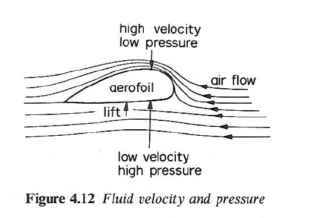
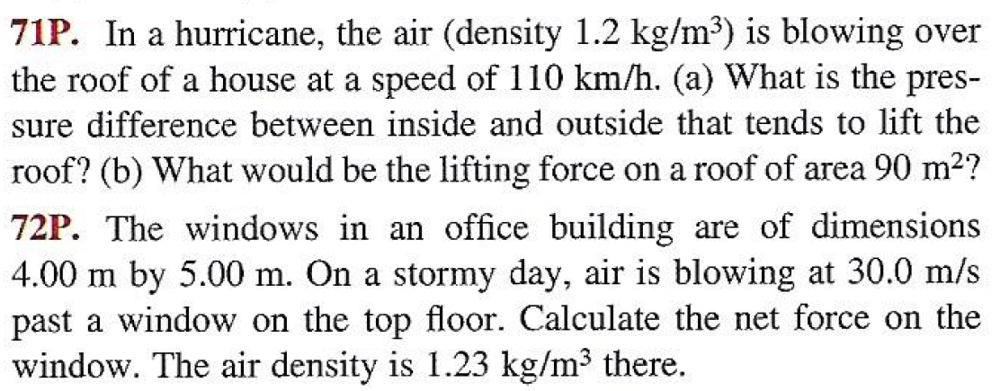

## Fluid Mechanics in the Physics Curriculum

"The integration of continuum mechanics into the physics curriculum could yield many benefits.  I do not presume that this integration would have to occur as a single separate course.  Greater attention to this field could be distributed in various parts of the undergraduate and graduate curricula, including courses in classical mechanics, condensed matter physics, and so on."

  -- [Jerry P. Gollub](https://www.haverford.edu/college-communications/news/jerry-gollub-1944-2019) (1944-2019)\*

      \* *Physics Today*, 56 (12):  10-11 (2003).

"The hydrodynamic equations are often closely analogous to the electrodynamic equations; that’s why we studied electrodynamics first. Some people argue the other way; they think that one should study hydrodynamics first so that it will be easier to understand electricity afterwards. But electrodynamics is really much easier than hydrodynamics."  

  -- [Richard P. Feynman](http://www.richardfeynman.com/about/bio.html) (1918-1988)\*\*

      \*\* *The Feynman Lectures in Physics*, vol. 2, ch. 40.  (Addison-Wesley, 1964.)

"We regard the transport phenomena course as a third semester of physics, made necessary by the fact that elementary physics includes almost no material on fluid dynamics, heat conduction, and diffusion."

  -- [R. Byron Bird](https://engineering.wisc.edu/news/chemical-engineering-pioneer-robert-byron-bird-passes-away-at-96/) (1924-2020)\*\*\*

      \*\*\* *Chemical Engineering Education*, Winter 1968, pp. 4-7.

**Welcome.**  In the following, I discuss encounters with fluid mechanics, as it appears in textbooks intended for major subjects in the core undergraduate and graduate physics curriculum.  This page is a work in progress; I appreciate your patience.

  -- Christopher Tong, Ph.D. (physics).

### Introductory physics

Nearly every introductory physics text includes coverage of fluid mechanics.  Conventional topics include density; pressure, its measurement, and its variation with depth/altitude; Pascal's Principle; buoyancy and Archimedes' Principle; classification of fluid flows; streamlines and the hydraulic continuity equation; the Bernoulli equation; the Venturi effect; Torricelli's efflux problem; and viscosity and the Reynolds Number.  Sometimes surface tension and capillarity; Poiseuille flow; aerodynamic lift and drag; and the Magnus effect are also discussed.  

The Bernoulli equation and aerodynamic lift are particularly tricky topics that some texts foul up.  A number of older texts incorrectly attributed aerodynamic lift solely to the cambered profile of an airfoil, without noting (by Newton's third law) that there must be a downward force (and thus deflection) on the air flowing around the airfoil.  Here is a typical example from Nelkon & Parker (1995, Ch. 4, pp. 127-128):

 

  
The streamlines under the airfoil appear to be almost completely horizontal; without an angle of attack, this profile cannot generate any lifting force!  While most well designed airfoils have camber, this design element is intended to enhance lift generated by flying at a nonzero angle of attack, rather than being the primary source of lift.  As Alexander (2009) notes,

"Airplane designers are intensely interested in how much lift a wing produces under different conditions, one of which is called the angle of attack--the angle between the wing and the direction it moves through the air....Camber can increase the amount of lift that a wing produces at any given angle of attack without much increase in drag....In fact, more than a few airplanes fly with zero-camber airfoils, usually called symmetrical airfoils.  Many supersonic airplanes have symmetrical airfoils, as did at least one Second World War fighter (the Bell P-39 Airacobra) and one small jet airliner (the Fokker F-28 Fellowship).  A wing with a symmetrical airfoil can still produce lift; it just does so entirely with angle of attack....Aerobatic airplanes that need to be able to fly equally well when they are upside down and right side up (such as the Pitts Special) also use zero-camber wings.  These airplanes often compensate for slightly less efficient wings with significantly more powerful engines."

When I was a graduate teaching assistant in the late 1990s, I encountered a more elementary error.  Halliday, Resnick, & Walker (1997, vol. 2, chapter 15) include the following homework problems.

These problems are meant to be solved using Bernoulli's equation for streamlines, but this requires you to tacitly assume that there is a streamline connecting the air outside the building with air inside the building.  However, typically the outside air's streamlines will be flowing *around* the building, not through it.  I am tempted to call this bad physics, an example of what [R. A. Shaw](https://doi.org/10.1119/1.4929153) called the "often over-simplified and even misleading treatments of mass continuity and the Bernoulli equation in introductory physics courses."  Jerry Gollub (2008)'s condemnation is decisive:  "The single largest difficulty I have encountered in incorporating fluid mechanics into introductory physics courses is that standard textbooks do a poor job in covering fluids."

### Classical mechanics

When I was an undergraduate in the early 1990s, most intermediate mechanics texts omitted fluids entirely.  Symon (1971, Ch. 8) and Arya (1997, Ch. 15) were two exceptions, both including a chapter on the mechanics of continuous media, consisting of vibrations on strings as well as fluid dynamics and sound waves.  Corben and Stehle (1994, Sec. 81) devote less space to fluid dynamics, but at least they include the Navier-Stokes equations as a "special application".  At the graduate level, the texts of Fetter &  Walecka (1980) and Jose & Saletan (1998, Sec. 9.5) are notable examples that include fluid dynamics.  Fetter & Walecka are particularly praiseworthy for celebrating the whole of continuum mechanics in the entire second half of their book (Ch. 7-13).  Finally, Appendix 2 of the classic Arnol'd (1989) discusses the formal correspondence between the Euler equations of rigid body dynamics and the Euler equations of ideal fluid flow.

In the years since my studenthood, more undergraduate mechanics texts are including chapters on fluid dynamics, though many of the most popular texts continue to competely ignore the topic.  Examples of the more enlightened texts include Taylor (2005, Ch. 16), Chaichian et al. (2012, Ch. 6), Deshmukh (2020, Ch. 11), and Hamill (2022, Ch. 19).  Jerry Gollub (2003) himself used the undergrad intermediate mechanics course to introduce fluid dynamics to his physics students, so it is heartening to see further progress in this direction, especially as Taylor (2005) has gained wide popularity.

### Electricity and magnetism

Magnetohydrodynamics (MHD) is understandably ignored in the canon of undergraduate E&M textbooks, with the remarkable but little-known exception of one by astrophysicist Attay Kovetz (2000), who devotes three entire chapters to it (Ch. 14-16).  In contrast, many graduate level texts do include a few token pages on the subject.  The ubiquitous Jackson (1999) has a single section (7.7) of about 3 pages on MHD, less than the 7-page chapter on the topic in Panofsky and Phillips (2005, Ch. 12).  Remarkably, the brief grad-level text by Melia (2001, Secs. 8.4-8.5) beats them both with just over 8 pages; the author's background as an astrophysicist may explain this.  Sadly, for many physicists the few pages on MHD in their graduate E&M text are the only ones on any fluid mechanics topic (beyond introductory physics) on their bookshelves.

### Statistical physics

A minority of texts in statistical physics cover fluid flow and transport phenomena, usually from the perspective of kinetic theory.  At the undergraduate level Desloge (1966, Ch. 32) is one example, but most that I know of are graduate-level texts such as Huang (1987, Ch. 5), McQuarrie (2000, Ch. 16-19), and Reichl (2016, Ch. 8-9) for example.  (McQuarrie was a chemist, but his book was strongly recommended to me by an experimental physicist.)  What about superfluidity?  At the undergrad level, Kittel & Kroemer (1980) devote a few pages to it at the end of their chapter on Fermi and Bose gases.  Again, most exapmles I know of are at the graduate level, such as Huang (1987, Ch. 13), Reichl (2016, Sec. 8.9), Ma (1985, Ch. 30), and Feynman (1998, Ch. 11).  It could be argued that the study of fluid mechanics naturally belongs with the study of thermodynamics and statistical physics:  Alessandro Bettini (2016) has done exactly that in the second of his four-volume *A Course in Classical Physics*.  

### Nonlinear dynamics

This subject is not yet a standard one in the physics curriculum, and much of it can be taught without reference to the equations of fluid dynamics.  However, the derivation of the famous Lorenz model requires hydroynamics, as illustrated in Appendix C of Hilborn (2000), Appendix A of Schuster & Just (2005), and in Part II of Fetter & Walecka (2006).  Historically there have many connections between fluid dynamics and nonlinear dynamics, and Gollub (2003) encouraged using this link to teach both.

### Mathematical methods 

Hydrodynamics can be a source of examples of mathematical methods in physics, as in Wyld (1976), and can also be used to help explain concepts of vector calculus, as in Boas (2006).  Morse & Feshbach (1953) include a 20-page section (2.3) on the motion of fluids, but more commonly, hydrodynamics is never explicitly mentioned in the standard textbooks of today.

### Computational physics

Computational physics is another not yet standard one in the physics curriculum.  Though computational fluid dynamics (CFD) is one of the oldest examples of computational science, it rarely makes an appearance in computational physics courses, perhaps because students do not have the necessary theoretical background.  One exception is Landau et al. (2015).  A hydrodynamics problem is given as a project for the chapter on elliptic PDEs in Koonin & Meredith (1990).

### Other courses

Physics students are likely to encounter fluid dynamics when they take courses on plasma physics, astrophysics, biological physics, soft matter physics, atmospheric dynamics, and environmental physics, for example.  There are good specialized texts on both magnetohydrodynamics and astrophysical fluid dynamics, which I won't enumerate here, except to mention a personal favorite, Choudhuri (1998).  Coverage in condensed matter physics texts is more hit-or-miss, as many of the standards completely ignore the subject.  Exceptions that I know of include Chaikin & Lubensky (2000) and Marder (2010).  

Most books titled *Classical Field Theory* focus exclusively on electromagnetic and gravitational fields -- indeed, these are the classical force fields.  That's not enough for Nastase (2019), who also covers hydrodynamics in chapters 7 and 19.  The latter chapter includes relativistic fluid dynamics.

### Other notable books

The third edition of Malcolm Longair's *Theoretical Concepts in Physics* (originally published in 1984) now includes a "gentle introduction" to fluid dynamics (Ch. 9 and parts of Ch. 10).  Rudolf Peierls' *More Surprises in Theoreteical Physics* includes a chapter (7) on hydrodynamics.

### A final thought

Physics students serious about fluids should explore the relevant courses in engineering, applied mathematics, and the geosciences, to acquire breadth in both subject matter and perspective.  The latter is arguably most important of all, in an interdisciplinary field like this.

### References

- V. I. Arnol'd, 1989:  *Mathematical Methods of Classical Mechanics*, 2d edition.  Graduate Texts in Mathematics, vol. 60.  Springer.

- D. E. Alexander, 2009:  *Why Don't Jumbo Jets Flap Their Wings?  Flying Animals,  Flying Machines, and How They Are Different.*  Rutgers University Press.

- A. P. Arya, 1997:  *Introduction to Classical Mechanics*, 2d edition.  Pearson.

- A. Bettini, 2016:  *A Course in Classical Physics 2--Fluids and Thermodynamics*.  Undergraduate Lecture Notes in Physics.  Springer.

- M. L. Boas, 2006:  *Mathematical Methods in the Physical Sciences*, 3d edition.  Wiley.

- M. Chaichian, I. Merches, and A. Tureanu, 2012: *Mechanics: An Intensive Course*. Springer.

- P. M. Chaikin and T. C. Lubensky, 2000.  *Principles of Condensed Matter Physics*, corrected reprint.  Cambridge University Press.

- A. R. Choudhuri, 1998:  *The Physics of Fluids and Plasmas:  An Introduction for Astrophysicists*.  Cambridge University Press.

- H. C. Corben and P. Stehle, 1994:  *Classical Mechanics*, 2d edition.  Dover.

- P. C. Deshmukh, 2020:  *Foundations of Classical Mechanics*.  Cambridge University Press.

- A. L. Fetter and J. D. Walecka, 1980:  *Theoretical Mechanics of Particles and Continua*. McGraw-Hill.  Reprinted by Dover, 2003.

- A. L. Fetter and J. D. Walecka, 2006:  *Nonlinear Mechanics:  A Supplement to Theoretical Mechanics of Particles and Continua*.  Dover.

- R. P. Feynman, 1998:  *Statistical Mechanics:  A Set of Lectures*.  Advanced Book Classics.  CRC Press.  Originally published 1972.

- J. Gollub, 2003:  Continuum mechanics in physics education.  *Physics Today*, 56 (12):  10-11.

- J. Gollub, 2008:  Teaching about fluids. *Physics Today*, 61 (10):  8-9.

- D. Halliday, R. Resnick, and J. Walker, 1997:  *Fundamentals of Physics*, 5th edition.  Wiley.

- P. Hamill, 2022:  *Intermediate Dynamics*, 2d edition.  Cambridge University Press.

- R. C. Hilborn, 2000:  *Chaos and Nonlinear Dynamics:  An Introduction for Scientists and Engineers*, 2d edition.  Oxford University Press.

- K. Huang, 1987:  *Statistical Mechanics*, 2d edition.  Wiley.

- J. D. Jackson, 1999: *Classical Electrodynamics*, 3d edition. Wiley.

- J. V. Jose and E. J. Saletan, 1998:  *Classical Dynamics: A Contemporary Approach*. Cambridge University Press.

- C. Kittel and H. Kroemer, 1980:  *Thermal Physics*.  W. H. Freeman.

- S. E. Koonin and D. C. Meredith, 1990:  *Computational Physics:  FORTRAN Version*.  Advanced Book Program.  Westview Press.

- A. Kovetz, 2000: *Electromagnetic Theory*. Oxford University Press.

- R. H. Landau, M. J. Paez, and C. C. Boreianu, 2015:  *Computational Physics:  Problem Solving with Python*, 3d edition.  Wiley-VCH.

- M. Longair, 2020:  *Theoretical Concepts in Physics:  An Alternative View of Theoretical Reasoning in Physics*, 3d edition.  Cambridge University Press.

- S. K. Ma, 1985:   *Statistical Mechanics*.  World Scientific.

- M. P. Marder, 2010:  *Condensed Matter Physics*, 2d edition.  Wiley.

- D. A. McQuarrie, 2000:  *Statisical Mechanics*.  University Science Books.

- F. Melia, 2001:  *Electrodynamics*.  Chicago Lectures in Physics.  University of Chicago Press.

- P. M. Morse and H. Feshbach, 1953:  *Methods of Theoretical Physics*, Part 1.  McGraw-Hill.

- H. Nastase, 2019:  *Classical Field Theory*.  Cambridge University Press.

- M. Nelkon and P. Parker, 1995:  *Advanced Level Physics*, 7th edition.  Heinemann.

- W. K. H. Panofsky and M. Phillips, 2005:  *Classical Electricity and Magnetism*, 2d edition.  Dover.

- R. Peierls, 1991:  *More Surprises in Theoretical Physics*.  Princeton University Press.

- L. E. Reichl, 2016:  *A Modern Course in Statistical Physics*, 4th edition.  Wiley-VCH.

- H. G. Schuster and W. Just, 2005:  *Deterministic Chaos:  An Introduction*, 4th edition.  Wiley-VCH.

- K. R. Symon, 1971:  *Mechanics*, 3d edition.  Addison-Wesley.

- J. R. Taylor, 2005:  *Classical Mechanics*. University Science Books.

- H. W. Wyld, 1976:  *Mathematical Methods for Physics*.  Lecture Notes and Supplements in Physics, vol. 15.  W. A. Benjamin.

[Return to main page](https://hydrodynamicstability.github.io/Invitation-to-Hydrodynamics/)

#### Disclaimers

The content on this site was developed solely on my personal time. The views expressed are solely my own, and do not necessarily represent the views, policies, or opinions of my employer or any organization with which I am affiliated.

(c) 2022 by Christopher Tong.  
